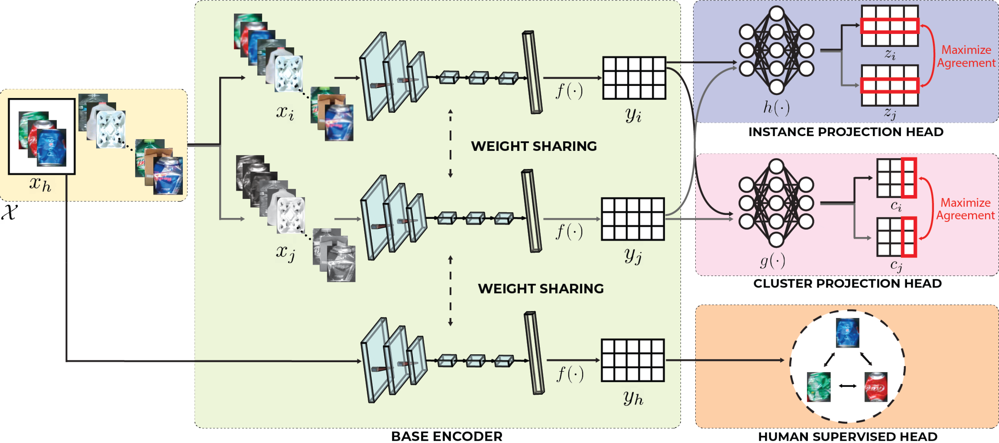
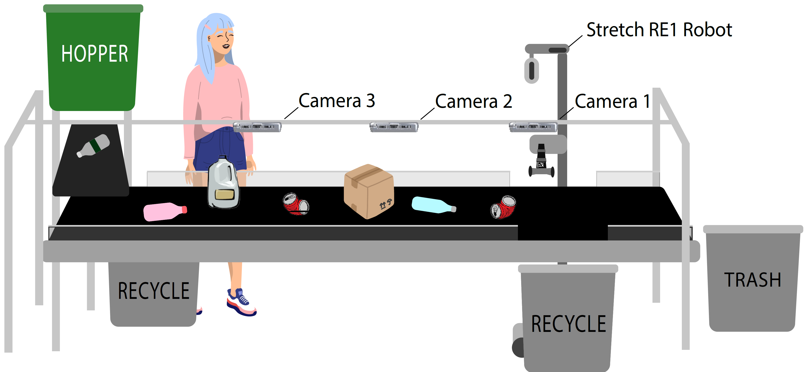
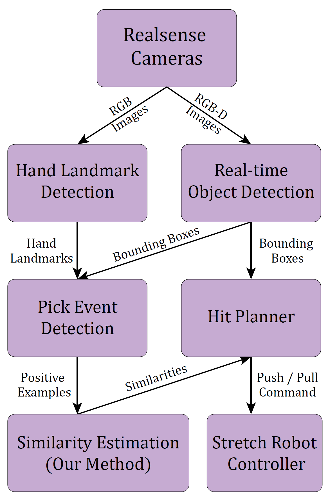

# Official Code for Tailoring Visual Object Representations to Human Requirements: A Case Study with a Recycling Robot
*Debasmita Ghose, Michal Adam Lewkowicz, Kaleb Gezahegn, Julian Lee, Timothy Adamson, Marynel Vazquez, Brian Scassellati*

*Yale University*

**Conference on Robot Learning, 2022 (CoRL, 2O22)**

[Paper](https://drive.google.com/file/d/1LOa3ugXvbT_Gd0myeg8thzOMIRyFgBIr/view?usp=sharing) | [Project Page](https://sites.google.com/view/corl22-contrastive-recycling/home)

## Abstract

Robots are well-suited to alleviate the burden of repetitive and tedious manipulation tasks. In many applications though, a robot may be asked to interact with a wide variety of objects, making it hard or even impossible to pre-program visual object classifiers suitable for the task of interest. In this work, we study the problem of learning a classifier for visual objects based on a few examples provided by humans. We frame this problem from the perspective of learning a suitable visual object representation that allows us to distinguish the desired object category from others. Our proposed approach integrates human supervision into the representation learning process by combining contrastive learning with an additional loss function that brings the representations of human examples close to each other in the latent space. Our experiments show that our proposed method performs better than self-supervised and fully supervised learning methods in offline evaluations and can also be used in real-time by a robot in a simplified recycling domain, where recycling streams contain a variety of objects.



## Experimental Setup

We use the Stretch RE-1 robot with a static push plate mounted on a telescopic arm to extract items from a moving conveyor belt (as shown in the supplementary video). The robot can extract items by either extending its telescopic arm to push objects off the conveyor belt or pulling objects towards itself. As shown in the figure below, the setup consists of a 60-gallon hopper, a small feeder belt, and the main conveyor belt (10 feet long and 1.5 feet wide). We position three cameras above the belt to monitor the recycling stream.

We use over 500 unique recyclable items of various sizes, shapes, colors, and forms in our experiments. The recyclables belong to ten categories: `crushed metal cans, un-crushed metal cans, crushed plastic bottles, un-crushed plastic bottles, un-crushed colored plastic bottles, brown cardboard boxes, coated cardboard boxes, cardboard trays, half-gallon milk jugs, and one-gallon milk jugs`. 
For randomizing the stream, the hopper dispenses a random selection of recyclables onto the feeder belt, which then transports the items to the main conveyor belt. A human can pick up some items of a given category by standing next to the conveyor belt. The robot is expected to sort items similar to the human-selected objects and extract them from the stream by pushing or pulling them off the conveyor belt.



## Running the Code


### Pre-Requisites

- Ubuntu 18.04
- ROS Melodic
- `conda env create --file=environment.yml`





### ROS nodes

- `real_time_object_detection.py`: ROS Wrapper to run inference over trained YOLACT mmdetection model and obtain a rotated bounding box over each object on the conveyor belt
- `convert_bboxes2real.py`: Convert 2D bounding boxes to 3D bounding boxes, using the pin-hole camera model and the depth of each object
- `transform_pose.py`: Convert pose of each object w.r.t. one camera to another camera
- `detect_aruco_markers`: Detect aruco markers in the environment
- `find_picked_object.py`: Detect which object on the moving conveyor belt has been picked by the person
- `contrastive_clustering_training.py`: Online training of our human supervised contrastive clustering approach
- `contrastive_clustering_inference.py`: Inference of our human supervised contrastive clustering approach
- `object_selection_planner.py`: Algorithm to plan which objects will be extracted by the robot
- `drop_object.py`: Robot code for pushing and pulling objects from the conveyor belt

### Human-Supervised Contrastive Clustering

- Download the dataset from [here](https://drive.google.com/drive/folders/1sd-OOL7UPMCnif-zo41AHoB3-sv5zuzy?usp=sharing)
- `cd scripts/human_supervised_cc`
- Change dataset path in `config/config.yaml`
- For training the model: `python train.py`
- For evaluating the model and calculating similarity metrics: `python average_evaluate.py`

## Citation

```
@inproceedings{ghose2022tailoring,
  title={Tailoring Visual Object Representations to Human Requirements: A Case Study with a Recycling Robot},
  author={Ghose, Debasmita and Lewkowicz, Michal Adam and Gezahegn, Kaleb and Lee, Julian and Adamson, Timothy and Vazquez, Marynel and Scassellati, Brian},
  booktitle={6th Annual Conference on Robot Learning},
  year={2022}
}
```


